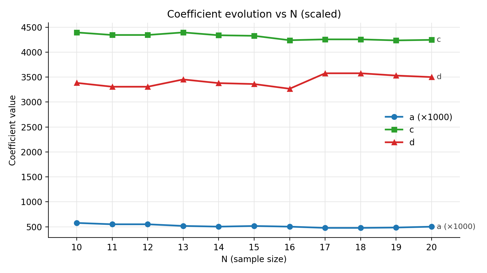
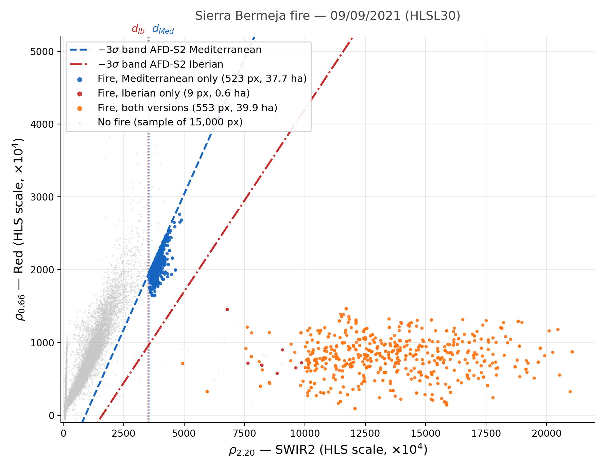
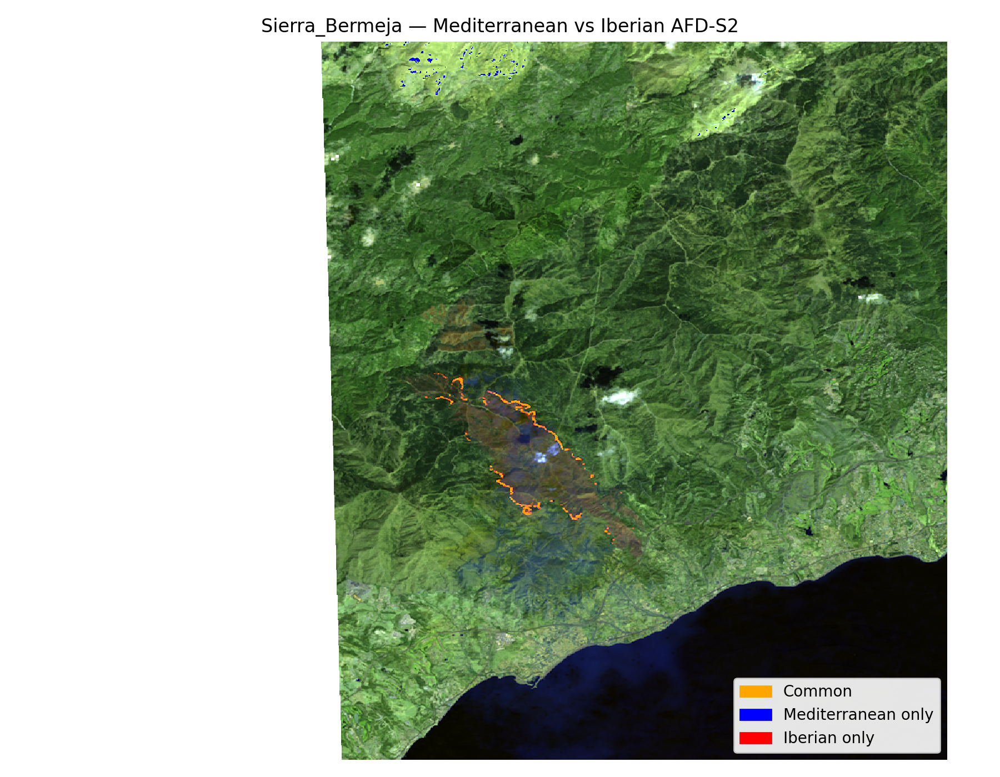
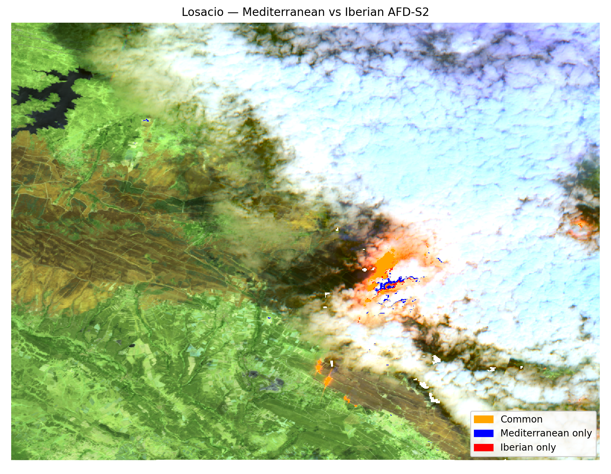
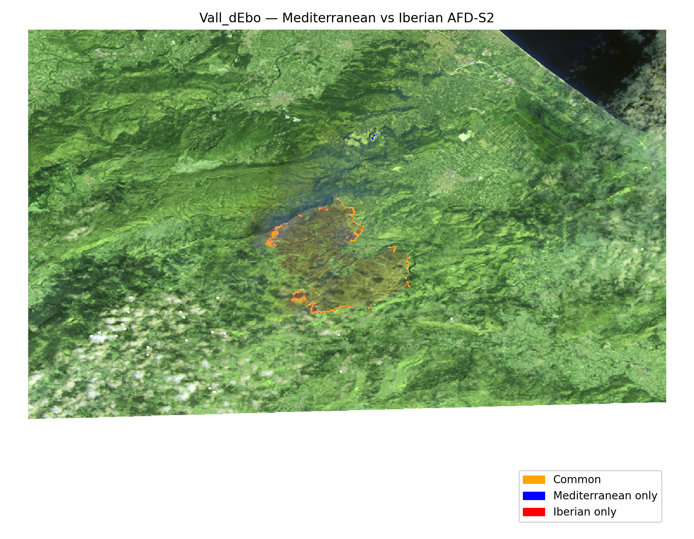
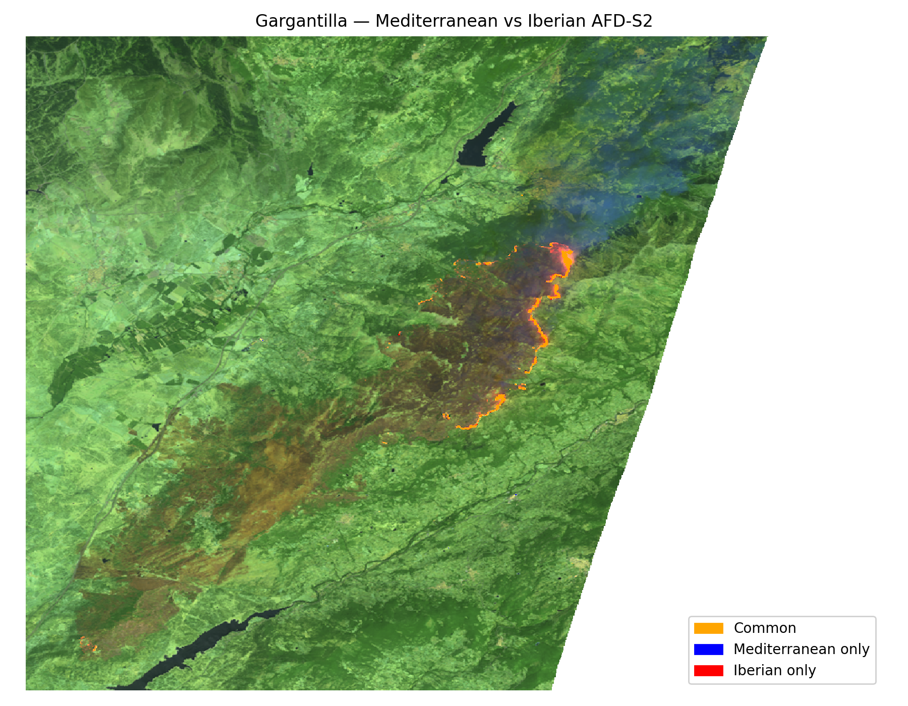
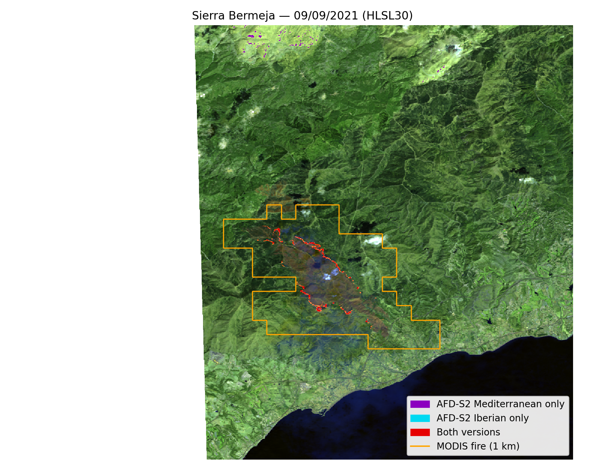
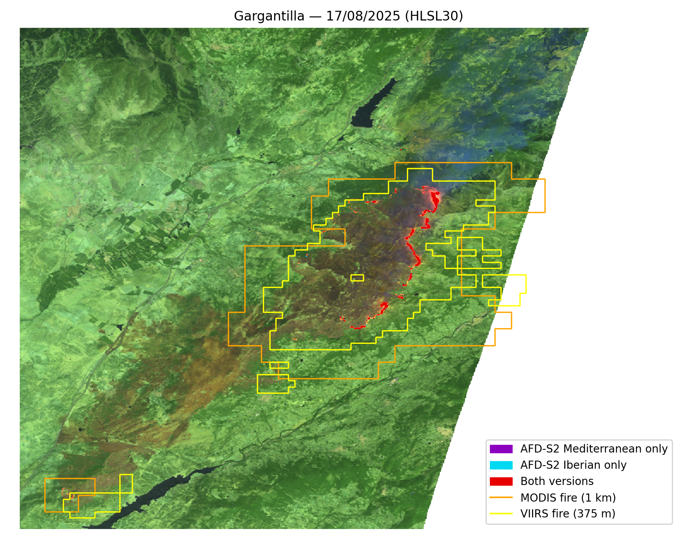

# AFD-HLS Iberian — Regional Calibration of an Active Fire Detection Algorithm for the Iberian Peninsula

Regional recalibration and validation of the **AFD-S2** active fire detection algorithm ([Hu et al., 2021](https://doi.org/10.3390/rs13234790)) for the Iberian Peninsula, using 30 m **Harmonized Landsat Sentinel-2 (HLS)** imagery, cross-validated against MODIS and VIIRS operational fire products.

> Master's thesis — MSc in Disaster Management (Universidad Complutense de Madrid / Universidad Politécnica de Madrid), June 2026.
> Author: **Guillermo Carreño Úbeda** · Supervisor: Gonzalo Barderas Machado

---

## Motivation

Operational active fire products — MODIS (1 km) and VIIRS (375 m) — are too coarse to resolve fire fronts in the fragmented Mediterranean landscapes of the Iberian Peninsula. The HLS programme delivers 30 m reflectance with a 2–3 day combined revisit, opening the door to decametric-scale active fire detection.

The AFD-S2 algorithm was originally calibrated on a global Mediterranean-biome sample. This work tests the hypothesis that **those global coefficients are too permissive for Iberian conditions**, and derives a regionally calibrated version: **AFD-HLS Iberian**.

## Key results

| Result | Value |
|---|---|
| Slope coefficient difference vs. original | **−32.6 %** (a = 0.501 vs. a = 0.743) |
| Coefficient convergence (N = 18 → 20) | **b, c, d change < 2.2 %**; the slope a changes 5.0 % (0.477 → 0.501) |
| Unconfirmed detections, Sierra Bermeja | **48.7 % → 0.5 %** |
| Unconfirmed detections, Vall d'Ebo | **8.8 % → 0 %** |
| Precision vs. VIIRS (Gargantilla) | **99.4 %** |
| Mean spatial agreement between versions (Jaccard, n=20) | **J = 0.844** |

*Values as reported in the thesis. Re-running the scripts reproduces them with small differences, listed in the [Appendix](#appendix-differences-with-the-thesis).*

The Mediterranean version detects **4.4× more exclusive pixels** than the Iberian version across the full sample — and the contextual validation shows most of those extra detections lack external confirmation, consistent with false positives over high-SWIR-reflectance summer surfaces.

### Calibrated coefficients

| Coefficient | AFD-S2 Mediterranean | AFD-HLS Iberian | Δ (%) |
|---|---|---|---|
| a (OLS slope) | 0.743 | **0.501** | −32.6 |
| b (OLS intercept −3σ) | −680 | **−808** | +18.8 |
| c (P99 SWIR1) | 4750 | **4239** | −10.8 |
| d (P99 SWIR2) | 3550 | **3506** | −1.2 |

*Values scaled by 1×10⁴ (HLS reflectance scale factor), except `a` which is dimensionless.*

---

## Data

- **HLS v2.0** (HLSS30 / HLSL30) — 30 m surface reflectance, Sentinel-2 MSI and Landsat-8/9 OLI harmonized
- **MODIS** MOD14A1 / MYD14A1 — 1 km active fire
- **VIIRS** SNPP & NOAA-20 (NASA LANCE C2) — 375 m active fire
- **EFFIS** — fire perimeter and date verification

### Study sample

20 large wildfires (>500 ha) across Spain (15) and Portugal (5), 2020–2025. Each fire is analysed over a 30×30 km AOI (bounding box of a 15 km buffer). 16 fires used for calibration, 4 held out for validation (Sierra Bermeja, Losacio, Vall d'Ebo, Gargantilla).

| # | Fire | Date | Country | Sensor | Role |
|---|---|---|---|---|---|
| 1 | Almonaster la Real | 2020-08-29 | ESP | HLSS30 | C |
| 2 | Navalacruz | 2021-08-15 | ESP | HLSL30 | C |
| 3 | Ribeira da Gafa | 2021-08-17 | POR | HLSS30 | C |
| 4 | Sierra Bermeja | 2021-09-09 | ESP | HLSL30 | **V** |
| 5 | Losacio | 2022-07-18 | ESP | HLSS30 | **V** |
| 6 | Ateca | 2022-07-19 | ESP | HLSL30 | C |
| 7 | Balteiro | 2022-08-05 | POR | HLSS30 | C |
| 8 | Vall d'Ebo | 2022-08-14 | ESP | HLSL30 | **V** |
| 9 | Bejís | 2022-08-18 | ESP | HLSS30 | C |
| 10 | Lecrín | 2022-09-10 | ESP | HLSS30 | C |
| 11 | Santa Coloma de Queralt | 2023-03-29 | ESP | HLSL30 | C |
| 12 | Pinofranqueado | 2023-05-19 | ESP | HLSS30 | C |
| 13 | São Teotónio | 2023-08-07 | POR | HLSS30 | C |
| 14 | Albergaria-a-Velha | 2024-09-18 | POR | HLSS30 | C |
| 15 | Terrenho | 2025-08-11 | POR | HLSS30 | C |
| 16 | Una de Quintana | 2025-08-11 | ESP | HLSS30 | C |
| 17 | Medeiros | 2025-08-16 | ESP | HLSS30 | C |
| 18 | Burón | 2025-08-17 | ESP | HLSL30 | C |
| 19 | Gargantilla | 2025-08-17 | ESP | HLSL30 | **V** |
| 20 | Cardoso | 2025-09-26 | POR | HLSS30 | C |

---

## Method

The AFD-S2 algorithm combines three criteria into a single active fire mask:

- **C1** — OLS regression of Red (ρ₀.₆₆) on SWIR2 (ρ₂.₂₀); pixels falling below the lower prediction band (−3σ) are fire candidates
- **C2** — SWIR2 threshold (99th percentile)
- **C3** — SWIR1 threshold with a disjunctive condition

Calibration procedure:

1. Compute `a`, `b`, `c`, `d` independently for each of the 16 calibration fires over its AOI
2. Run an incremental convergence analysis from N=10 to N=20 to verify coefficient stabilisation
3. Adopt the arithmetic mean as the final Iberian parameter set

Validation:

- **Spatial agreement** between versions via the Jaccard index over all 20 fires
- **Contextual categorisation** of HLS detections against MODIS/VIIRS (CAT 1: confirmed by both; CAT 2: confirmed by one; CAT 3: unconfirmed), given the 30 m vs. 375 m/1 km scale mismatch that makes pixel-to-pixel comparison uninformative
- **Precision/recall** vs. VIIRS where data are available

> ⚠️ VIIRS data in GEE come from the LANCE near-real-time collections, which are retained only for a limited period. Only Gargantilla (Aug 2025) had VIIRS coverage at the HLS acquisition dates; the other three validation fires were validated against MODIS only.

---

## Figures

All figures are generated by the Python scripts in `python/` and saved under `data/results/figures/`.

### Coefficient convergence (thesis Fig. 4.1)

Mean Iberian coefficients as the calibration sample grows from N = 10 to N = 20 (`coefficient_analysis.py`; `a` scaled ×1000). The other charts in `coefficients/` show each coefficient separately, its standard deviation and its coefficient of variation.



### Red vs SWIR2 scatter, Sierra Bermeja (thesis Fig. 4.2)

Lower prediction bands (−3σ) of both versions over the real HLS pixels (`scatter_plot.py`). The steeper Mediterranean band (a = 0.743) lets through the blue cloud between the two lines: pixels only the Mediterranean version flags as fire.



### Spatial agreement between versions (thesis Fig. 4.3)

Detections of both versions over the four validation fires on a SWIR2–SWIR1–Red false-color composite (`jaccard.py`). Orange: both versions; blue: Mediterranean only; red: Iberian only.

| Sierra Bermeja (J = 0.510) | Losacio (J = 0.665) |
|---|---|
|  |  |
| **Vall d'Ebo (J = 0.835)** | **Gargantilla (J = 0.967)** |
|  |  |

### Validation against MODIS/VIIRS (thesis Fig. 4.4)

HLS detections with the MODIS (orange, 1 km) and VIIRS (yellow, 375 m) fire pixels outlined (`modis_viirs_afd_validation.py`). Purple: Mediterranean only; cyan: Iberian only; red: both versions. In Sierra Bermeja the Mediterranean-only detections at the top of the scene fall over bright surfaces far from any MODIS fire pixel; Gargantilla is the only fire with VIIRS data.

| Sierra Bermeja (MODIS only) | Gargantilla (MODIS + VIIRS) |
|---|---|
|  |  |

---

> The thesis also includes a temporal case study of the Terrenho fire (August 2025) combining HLS with MTG FRP. That case study lives in its own repository; this one covers only the calibration and validation of the Iberian algorithm.

---

## Repository structure

```
.
├── gee/
│   └── wildfires_data.js            # Fire sample metadata (centres, AOI buffers, date windows)
├── gee/scripts/
│   ├── coeficients.js               # OLS coefficient computation per fire and per N
│   ├── coeficient_analysis.js       # Coefficient evolution charts (N=10→20)
│   ├── jaccard.js                   # Mediterranean vs Iberian comparison, Jaccard index
│   ├── pixels_per_fire.js           # Valid pixel count per AOI
│   ├── scatter_sierra_bermeja.js    # Red vs SWIR2 scatter export
│   └── modis_viirs_afd_validation.js # Validation vs MODIS/VIIRS (one fire per run, + exports)
├── python/
│   ├── paths.py                     # Default input/output folders (single source of truth)
│   ├── geodesy.py                   # Pixel areas on the WGS84 ellipsoid
│   ├── coefficients.py              # Port of coeficients.js
│   ├── coefficient_analysis.py      # Port of coeficient_analysis.js
│   ├── jaccard.py                   # Port of jaccard.js (+ comparison maps)
│   ├── pixels_per_fire.py           # Port of pixels_per_fire.js
│   ├── scatter_validation.py        # Red vs SWIR2 scatter data of the validation fires
│   ├── scatter_plot.py              # Red vs SWIR2 scatter figures
│   └── modis_viirs_afd_validation.py # Port of modis_viirs_afd_validation.js, 4 fires (+ maps)
├── data/
│   ├── hls_imagery/                 # HLS GeoTIFFs exported from GEE (input)
│   ├── modis_viirs/                 # <fire>_MODIS_active.tif / <fire>_VIIRS_active.tif from GEE (input)
│   └── results/
│       ├── coefficients/            # coefficients_by_n.csv, coefficients_per_fire.csv
│       ├── jaccard/                 # jaccard_per_fire.csv
│       ├── pixels/                  # pixels_per_fire.csv
│       ├── scatter/                 # scatter_Red_SWIR2_<fire>.csv (not versioned: run scatter_validation.py)
│       ├── validation/              # validation_per_fire.csv
│       └── figures/
│           ├── coefficients/        # coef_*_vs_n.png
│           ├── jaccard/             # jaccard_map_<fire>.png
│           ├── scatter/             # scatter_Red_SWIR2_<fire>.png
│           └── validation/          # validation_map_<fire>.png
└── docs/
    └── TFM_GCU.pdf                  # Full thesis (Spanish, not versioned)
```

## Requirements

- A [Google Earth Engine](https://earthengine.google.com/) account (JavaScript Code Editor) with the HLS scenes uploaded as assets
- Python 3.10+ with `numpy`, `pandas`, `matplotlib` and `rasterio`

## Usage

GEE scripts are run directly in the Code Editor and export their results to Google Drive. The Python scripts reproduce them locally from the HLS GeoTIFFs in `data/hls_imagery/`, with areas computed on the WGS84 ellipsoid; every script documents its options in its `Usage` header.

```bash
python python/coefficients.py --per-fire     # 1. Calibration: coefficients per fire and per N
python python/coefficient_analysis.py        # 2. Coefficient convergence charts
python python/jaccard.py                     # 3. Spatial agreement between versions (+ maps)
python python/pixels_per_fire.py             #    Valid pixel count per AOI
python python/scatter_validation.py          # 4. Red vs SWIR2 scatter data of the validation fires
python python/scatter_plot.py --all          #    ... and figures
python python/modis_viirs_afd_validation.py  # 5. Validation vs MODIS/VIIRS (+ maps)
```

Step 5 needs the reference masks exported by `gee/scripts/modis_viirs_afd_validation.js` (`<fire>_MODIS_active.tif`, `<fire>_VIIRS_active.tif`; run it once per fire with `selectedIndex` 0–3), exports downloaded from Google Drive to `data/modis_viirs/`.

---

## Limitations

- Coefficients `a` and `b` show high dispersion (CV 45.3 % and 73.8 %), driven by scene composition: partial cloud cover, water bodies within the AOI, burned fraction, and vegetation heterogeneity
- Two out-of-season fires (March and May) suggest seasonal calibration could be worthwhile for operational use
- Subgroup calibration (by sensor, ecoregion, or vegetation type) would require substantially larger per-group samples

## Appendix: differences with the thesis

Re-running the analysis with the Python scripts in this repository reproduces the thesis results, with the differences below. The README sections above quote the thesis values.

### A.1 Pixel areas

The HLS assets are on an EPSG:4326 grid (~0.000269° pixels): ~30 m north–south but only ~22–24 m east–west at Iberian latitudes, i.e. ~650–720 m² per pixel instead of the nominal 900 m².

- The thesis mixes two conventions: Table 4.4 (Jaccard) and the captions of Figs. 4.2 and 4.4 use the nominal 0.09 ha/pixel, while Tables 4.5 and 4.6 (MODIS/VIIRS validation) use the true pixel area (`ee.Image.pixelArea()`). The same Mediterranean detections in Sierra Bermeja are therefore 96.8 ha in Table 4.4 and 77.40 ha in Table 4.5.
- This repository computes every area on the WGS84 ellipsoid (`python/geodesy.py`). `jaccard_per_fire.csv` also keeps the nominal values (`ha_med_nominal`, `ha_ib_nominal`), which match Table 4.4.

### A.2 Iberian coefficients

The Python port computes the coefficients over every valid pixel with exact percentiles; GEE uses `reduceRegion` with `bestEffort` and a histogram-based percentile reducer. Final values (N = 20):

| | a | b | c | d |
|---|---|---|---|---|
| Thesis (Table 4.2, GEE) | 0.5009 | −808.17 | 4238.57 | 3505.90 |
| This repository | 0.5011 | −808.38 | 4247.06 | 3500.78 |

The mean values for N = 10–19 differ by the same order (< 0.3 %). The scripts take the Iberian coefficients from `coefficients_by_n.csv`, so the Iberian masks change by a few pixels:

- **Mediterranean results are identical** to the thesis (fixed coefficients).
- **Iberian-only pixels** (Table 4.4) differ in 7 of the 20 fires, e.g. Losacio 470 vs 485, Navalacruz 92 vs 97; total 1,112 vs 1,140. The Mediterranean/Iberian ratio of exclusive pixels becomes 4.5 instead of 4.4.
- **Mean Jaccard** is unchanged (J = 0.844); validation fires 0.744 vs 0.743.
- Iberian totals in Table 4.5 change accordingly (Losacio 232.08 vs 233.08 ha; Gargantilla 98.24 vs 98.30 ha).

### A.3 MODIS/VIIRS categorisation of Gargantilla (Table 4.5)

In `gee/scripts/modis_viirs_afd_validation.js` the LANCE VIIRS composite is masked (not 0) outside VIIRS fire pixels. When VIIRS has data, every HLS detection outside a VIIRS fire pixel is masked too and drops out of all three categories. That is why, for Gargantilla, Table 4.5 shows CAT 2 = CAT 3 = 0 and the categories do not add up to the total (95.08 of 96.24 ha). The other three fires have no VIIRS data and are not affected.

`modis_viirs_afd_validation.py` counts those pixels as "not confirmed by VIIRS":

| Gargantilla | Total (ha) | CAT 1 | CAT 2 | CAT 3 | Confirmation rate |
|---|---|---|---|---|---|
| Mediterranean — thesis | 96.24 | 95.08 | 0.00 | 0.00 | 100.0 % |
| Mediterranean — this repository | 96.24 | 94.80 | 0.27 | 1.17 | 98.8 % |
| Iberian — thesis | 98.30 | 97.76 | 0.00 | 0.00 | 100.0 % |
| Iberian — this repository | 98.24 | 97.41 | 0.27 | 0.55 | 99.4 % |

The 1.17 ha now in CAT 3 are the 1.16 ha missing from the thesis row. The conclusion holds (the Iberian version is still the better-confirmed one), but neither version reaches 100 %. The VIIRS metrics of Table 4.6 are not affected and are reproduced exactly (precision 98.8 % / 99.4 %, recall 1.2 % / 1.3 %, ~7,800 ha of VIIRS fire).

### A.4 MODIS/VIIRS categorisation of the other fires (Table 4.5)

The GEE script reprojects MODIS straight from its sinusoidal grid to 30 m, while the Python port reads the 1 km EPSG:4326 export, which shifts the edges of some MODIS pixels. The differences stay within ~1.1 ha:

| Fire | Version | CAT 2 thesis / repo (ha) | CAT 3 thesis / repo (ha) | Confirmation rate thesis / repo |
|---|---|---|---|---|
| Sierra Bermeja | Mediterranean | 39.71 / 39.93 | 37.68 / 37.69 | 51.3 / 51.4 % |
| | Iberian | 40.36 / 40.58 | 0.22 / 0.00 | 99.5 / 100.0 % |
| Losacio | Mediterranean | 264.30 / 263.16 | 6.03 / 7.16 | 97.8 / 97.4 % |
| | Iberian | 232.08 / 231.88 | 1.00 / 0.20 | 99.6 / 99.9 % |
| Vall d'Ebo | Mediterranean | 60.30 / 60.30 | 5.81 / 5.81 | 91.2 / 91.2 % |
| | Iberian | 66.26 / 66.26 | 0.00 / 0.00 | 100.0 / 100.0 % |

### A.5 Scatter plot of Sierra Bermeja (Fig. 4.2)

- The legend of Fig. 4.2 reports 735 Mediterranean-only pixels (66.1 ha) and 896 pixels detected by both versions (80.6 ha). Those counts do not match Table 4.4 (523 Mediterranean-only pixels, 553 common) and could not be reproduced. The figure in this repository uses the real masks: 523 Mediterranean-only, 9 Iberian-only and 553 common pixels.
- Fig. 4.2 crops the SWIR2 axis at 8,500. Half of the fire pixels of Sierra Bermeja have SWIR2 > 8,500 (up to ~21,000, saturated active fire), so the repository figure extends the axis to show them all (`scatter_plot.py --xmax 8500` restores the thesis framing).

## References

- Hu, X. et al. (2021). *Sentinel-2 MSI data for active fire detection in major fire-prone biomes: A multi-criteria approach.* International Journal of Applied Earth Observation and Geoinformation.
- Schroeder, W. et al. (2016). *Active fire detection using Landsat-8/OLI data.* Remote Sensing of Environment.
- Gorelick, N. et al. (2017). *Google Earth Engine: Planetary-scale geospatial analysis for everyone.* Remote Sensing of Environment.
- San-Miguel-Ayanz, J. et al. (2012). *Comprehensive monitoring of wildfires in Europe: the European Forest Fire Information System (EFFIS).*

## Citation

```bibtex
@mastersthesis{carreno2026afdhls,
  author  = {Carreño Úbeda, Guillermo},
  title   = {Adaptación y validación del algoritmo AFD-S2 para la detección
             de fuego activo en la Península Ibérica mediante imágenes HLS
             y análisis multifuente},
  school  = {Universidad Complutense de Madrid},
  year    = {2026},
  type    = {Master's thesis},
  address = {Madrid, Spain}
}
```

## License

MIT — see [LICENSE](LICENSE).
